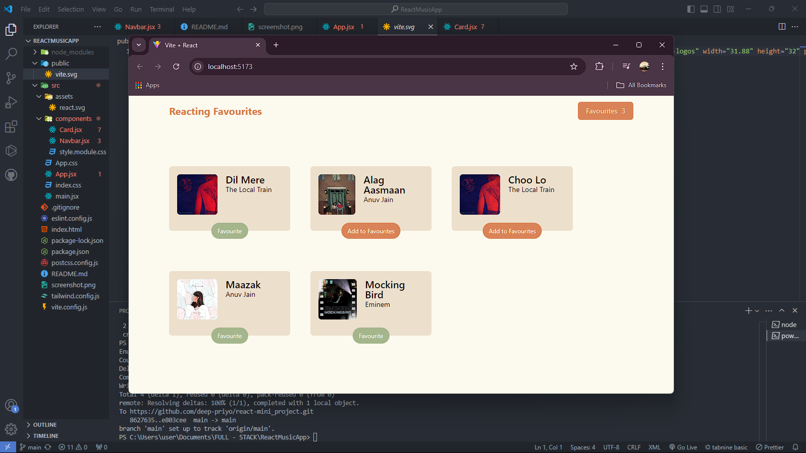

# 🎶 Reacting Favourites

Welcome to **Reacting Favourites**! This project is a simple React web application that allows users to add or remove songs from their favorites list with ease. It features a clean UI and dynamically updates the favorite count in the navigation bar.



## ✨ Features

- **Responsive Design** 📱: The app adapts to different screen sizes, making it user-friendly across devices.
- **Add to Favourites** ❤️: Easily add or remove songs from your favorites list with a single click.
- **Dynamic Navbar** 🧮: The navbar automatically updates with the total number of favorite songs.
- **Minimalistic UI** 🎨: Clean and elegant design with soft background colors and bold text for a better user experience.

## 🚀 Installation

To get started with the project, follow these steps:

1. Clone the repository:

   ```bash
   git clone https://github.com/<your-username>/reacting-favourites.git
